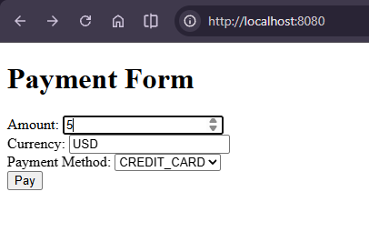
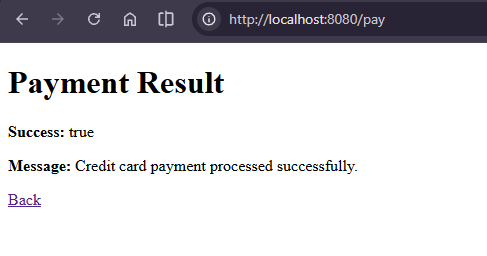
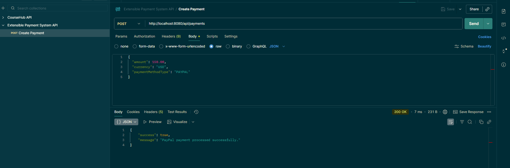
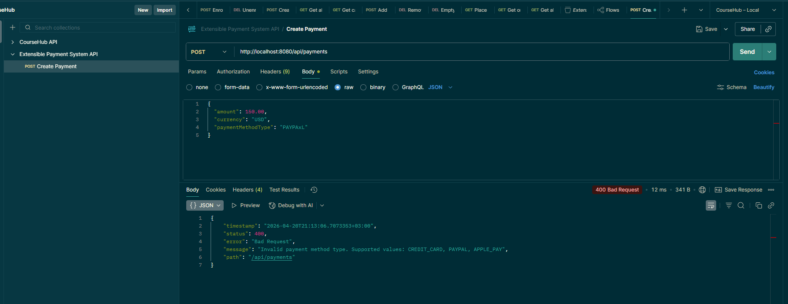
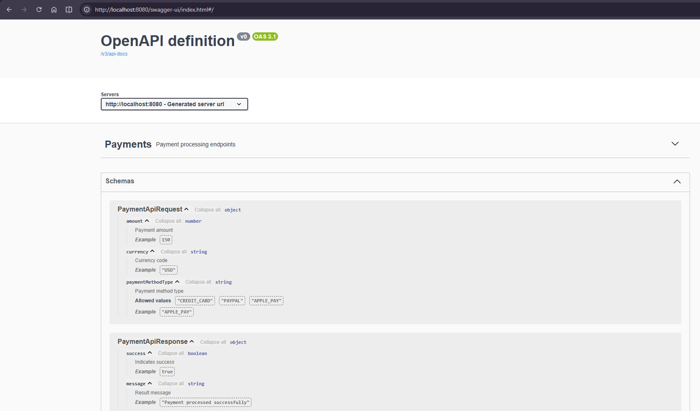
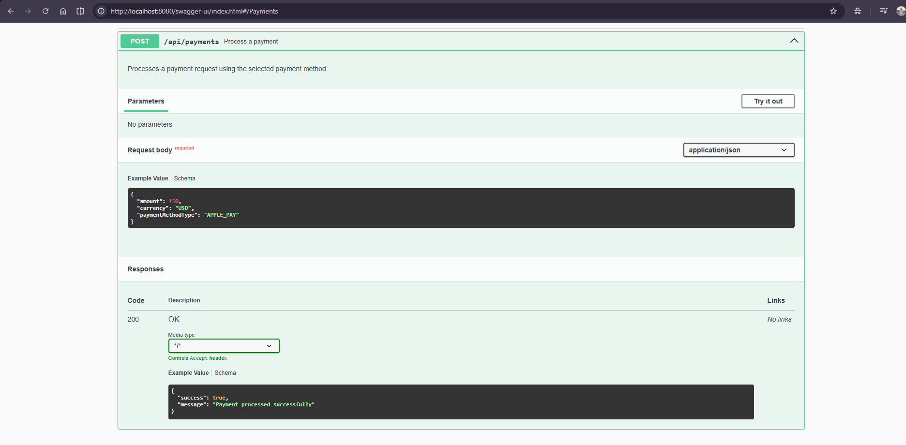
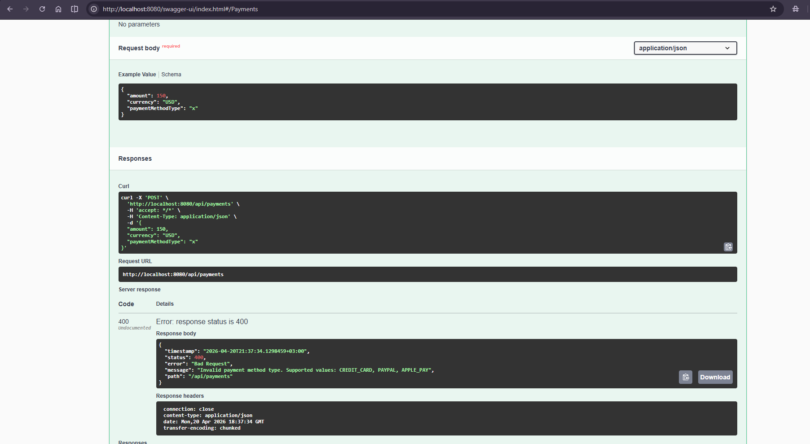
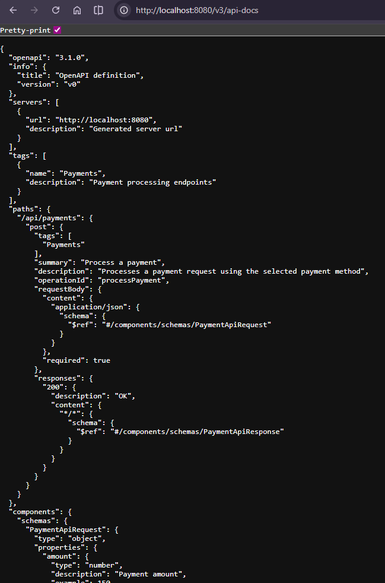

# Extensible Payment System

A Java-based payment system designed to demonstrate how to integrate new payment methods into an existing architecture while following SOLID principles.

This project started as a plain Java console application and was later extended with a **Spring Boot REST API** and a minimal **Thymeleaf UI** as a bonus improvement.

Core architecture demonstrates reflection-based discovery to satisfy the extensibility requirement. In a Spring-native version, the same responsibility could also be delegated to the container by injecting all PaymentProcessor beans.

---

## Objective

This project aims to design a payment processing system that:

* minimizes modification of existing code
* allows easy addition of new payment methods
* follows SOLID principles, especially **OCP** and **SRP**
* uses **Chain of Responsibility** for workflow orchestration
* uses **Reflection** for dynamic discovery of payment processors
* exposes the payment flow through both:

  * a REST API
  * a simple server-side rendered web interface

---

## API Documentation (Swagger)

The project includes Swagger UI for interactive API documentation.

### Access Swagger UI

```text
http://localhost:8080/swagger-ui/index.html
```

### OpenAPI JSON

```text
http://localhost:8080/v3/api-docs
```

### Features

- Test API endpoints directly from browser
- View request/response schemas
- Explore available payment methods

## Demo Screens

The following screenshots demonstrate the application from both UI and API perspectives.

### Thymeleaf Payment Form


### Thymeleaf Payment Result


### Postman - Successful Payment Request


### Postman - Invalid Payment Method Error


### Swagger UI




### API DOCS


## Architecture Overview

The system is composed of the following core components.

### 1. Payment Chain (Chain of Responsibility)

The payment flow is divided into multiple handlers:

* `PaymentValidationHandler`
* `PaymentMethodResolutionHandler`
* `PaymentExecutionHandler`
* `PaymentLoggingHandler`

Each handler has a single responsibility and passes control to the next handler.

### 2. Payment Processor Layer

Each payment method is implemented as a separate class:

* `CreditCardPaymentProcessor`
* `PaypalPaymentProcessor`
* `ApplePayPaymentProcessor`

All processors implement the same contract:

```java
public interface PaymentProcessor {
    PaymentResult process(PaymentRequest request);
}
```

### 3. Reflection-Based Processor Discovery

Instead of manually registering payment processors in the application entry point, the system uses reflection.

Each processor is annotated like this:

```java
@PaymentMethod("PAYPAL")
public class PaypalPaymentProcessor implements PaymentProcessor {
    @Override
    public PaymentResult process(PaymentRequest request) {
        return new PaymentResult(true, "PayPal payment processed successfully.");
    }
}
```

At runtime, the registry:

* scans the base package
* finds classes annotated with `@PaymentMethod`
* instantiates them automatically
* registers them into the processor map

This makes the system extensible without changing the existing orchestration flow.

### 4. Enum-Based Payment Type Safety

To improve safety and avoid string-based errors, payment method types are represented with an enum:

```java
public enum PaymentType {
    CREDIT_CARD,
    PAYPAL,
    APPLE_PAY
}
```

This reduces typo-related issues and centralizes supported payment method values.

### 5. Spring Boot Web Layer

As a bonus extension, the project includes:

* a REST controller for API-based payment processing
* a Thymeleaf-based web page for simple manual interaction
* centralized exception handling for meaningful HTTP error responses

---

## Payment Flow

The request goes through the following chain:

```text
Request -> Validation -> Method Resolution -> Execution -> Logging -> Result
```

Step by step:

1. The request is validated.
2. The appropriate payment processor is resolved from the registry.
3. The payment is executed.
4. The result is logged.
5. The final payment result is returned.

---

## API Layer

The REST API exposes the payment flow through:

```text
POST /api/payments
```

### Example Request

```json
{
  "amount": 150.00,
  "currency": "USD",
  "paymentMethodType": "APPLE_PAY"
}
```

### Example Success Response

```json
{
  "success": true,
  "message": "Apple Pay payment processed successfully."
}
```

### Example Error Response

```json
{
  "timestamp": "2026-04-20T20:34:56.607333+03:00",
  "status": 400,
  "error": "Bad Request",
  "message": "Invalid payment method type. Supported values: CREDIT_CARD, PAYPAL, APPLE_PAY",
  "path": "/api/payments"
}
```

---

## UI Layer

The application also includes a minimal Thymeleaf-based UI.

Pages:

* `payment-form.html`
* `payment-result.html`

This UI allows the user to:

* enter an amount
* choose a currency
* select a payment method
* submit the payment request
* view the result on a rendered page

---

## Exception Handling

The project includes centralized exception handling through:

* `GlobalExceptionHandler`

Handled scenarios include:

* invalid payment request input
* unsupported payment method
* invalid enum conversion / malformed payment type
* unexpected server-side errors

This improves API usability by returning structured and meaningful error responses instead of generic server errors.

---

## How to Add a New Payment Method

To add a new payment method:

1. Create a new class implementing `PaymentProcessor`
2. Annotate it with `@PaymentMethod(...)`
3. Add the corresponding enum constant to `PaymentType`

Example:

```java
@PaymentMethod("APPLE_PAY")
public class ApplePayPaymentProcessor implements PaymentProcessor {

    @Override
    public PaymentResult process(PaymentRequest request) {
        return new PaymentResult(true, "Apple Pay payment processed successfully.");
    }
}
```

No changes are required in:

* `PaymentService`
* handler chain classes
* registry usage
* existing processor implementations

This demonstrates the **Open/Closed Principle** in practice.

---

## SOLID Principles Applied

### Open/Closed Principle (OCP)

The system is open for extension but closed for modification.

A new payment method can be added by introducing a new processor class without modifying the existing payment flow.

### Single Responsibility Principle (SRP)

Each class has a focused responsibility.

Examples:

* validation is handled by `PaymentValidationHandler`
* processor lookup is handled by `PaymentMethodResolutionHandler`
* payment execution is handled by `PaymentExecutionHandler`
* logging is handled by `PaymentLoggingHandler`
* API error translation is handled by `GlobalExceptionHandler`

---

## Project Structure

```text
com.velihangozek.payment
├── Application.java
├── annotation
│   └── PaymentMethod.java
├── chain
│   ├── PaymentHandler.java
│   ├── AbstractPaymentHandler.java
│   ├── PaymentValidationHandler.java
│   ├── PaymentMethodResolutionHandler.java
│   ├── PaymentExecutionHandler.java
│   └── PaymentLoggingHandler.java
├── enums
│   └── PaymentType.java
├── exception
│   ├── GlobalExceptionHandler.java
│   ├── PaymentException.java
│   ├── InvalidPaymentRequestException.java
│   └── UnsupportedPaymentMethodException.java
├── model
│   ├── PaymentContext.java
│   ├── PaymentRequest.java
│   └── PaymentResult.java
├── processor
│   ├── PaymentProcessor.java
│   ├── CreditCardPaymentProcessor.java
│   ├── PaypalPaymentProcessor.java
│   └── ApplePayPaymentProcessor.java
├── registry
│   └── PaymentProcessorRegistry.java
├── service
│   └── PaymentService.java
└── web
    ├── PageController.java
    ├── PaymentController.java
    └── dto
        ├── ApiErrorResponse.java
        ├── PaymentApiRequest.java
        └── PaymentApiResponse.java
```

### Resources

```text
src/main/resources
├── application.properties
└── templates
    ├── payment-form.html
    └── payment-result.html
```

---

## Technologies Used

* Java 21
* Maven
* Spring Boot
* Spring Web
* Thymeleaf
* Reflections library
* Spring Boot logging
* Postman (for API testing)
* Swagger / OpenAPI (springdoc)

---

## How to Run

Build the project:

```bash
mvn clean install
```

Run the application:

```bash
mvn spring-boot:run
```

Or run `Application.main()` from the IDE.

---

## Access Points

### REST API

```text
POST http://localhost:8080/api/payments
```

### Thymeleaf UI

```text
GET http://localhost:8080/
```

---

## Postman Test Example

### Request

```json
{
  "amount": 150.00,
  "currency": "USD",
  "paymentMethodType": "APPLE_PAY"
}
```

### Expected Response

```json
{
  "success": true,
  "message": "Apple Pay payment processed successfully."
}
```

---

## Notes

* Reflection-based processor discovery eliminates manual registration in the application layer.
* Enum usage improves type safety compared to raw string-based payment method handling.
* Global exception handling improves API clarity and produces better HTTP responses.
* The Spring Boot and Thymeleaf layers were added as a bonus enhancement on top of the original core architecture.

---

## Possible Future Improvements

* add unit and integration tests
* improve form validation on the Thymeleaf page
* persist payment requests/results with a database
* add Docker support
* add CI pipeline configuration

---

## Conclusion

This project was built to demonstrate clean backend architecture and extensibility principles in a real-world inspired payment flow scenario.

It shows:

* extensibility with minimal modification
* separation of concerns
* annotation-driven discovery
* API-level and UI-level integration
* structured error handling

The result is a system that is easy to understand, easy to extend, and suitable for demonstrating backend design skills in a practical way.